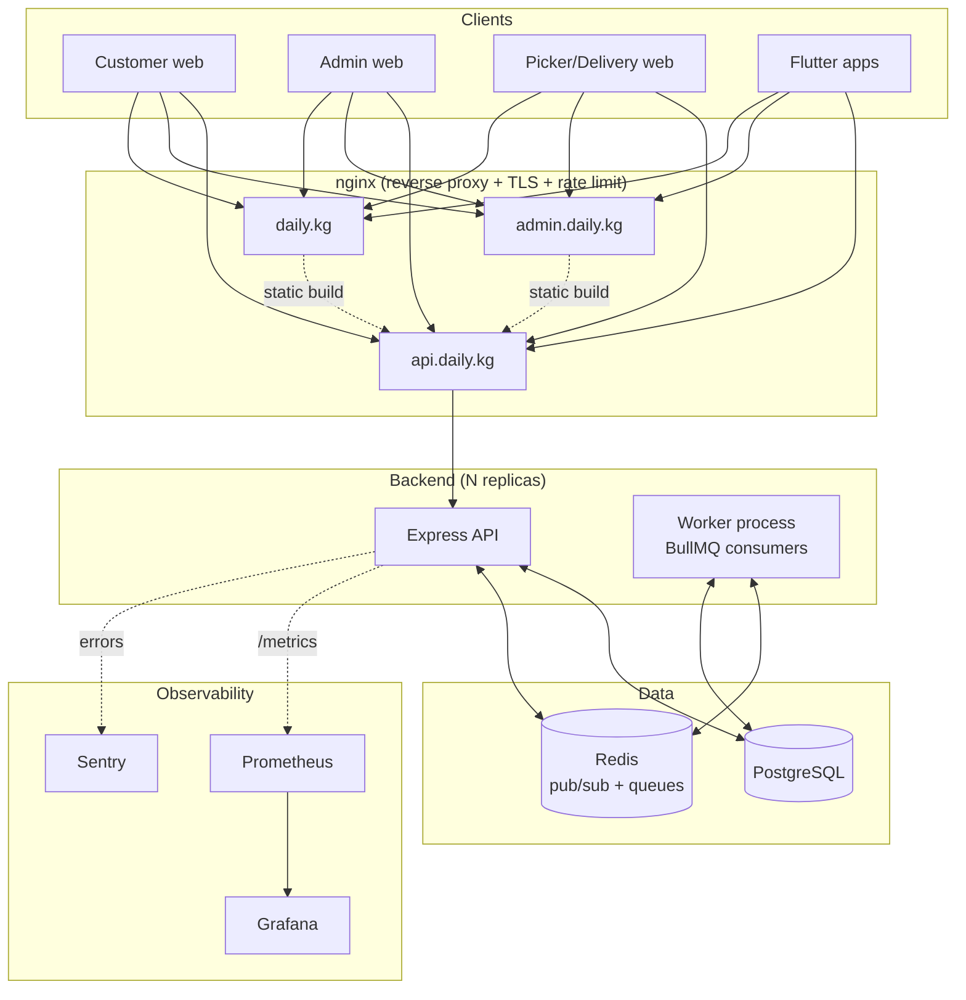
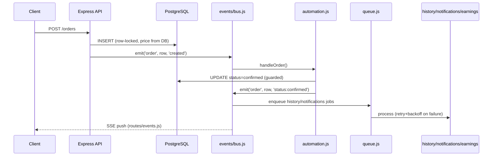

# Architecture

## Current production topology

## Why each piece exists

| Component | Why | Status |
|---|---|---|
| **nginx (reverse proxy + gateway)** | Single TLS termination point, routes by domain, edge-level rate limiting before a flood even reaches Node, serves the built SPAs directly | `nginx/nginx.conf` — ready |
| **Load Balancer** | nginx's `upstream backend_api { server backend:3001; }` round-robins across every backend replica Docker Compose scales — this is the LB, not a separate product | Built into `nginx/nginx.conf` |
| **Redis (pub/sub)** | `bus.js` needs it the moment there's more than one backend instance — without it, an SSE client connected to replica A never sees an order event that replica B processed | `backend/src/events/bus.js` — graceful fallback to single-instance mode without it |
| **Redis (BullMQ)** | Retry/backoff/dead-letter for notifications, history, earnings, email — a transient DB error no longer silently drops a customer notification forever | `backend/src/queue.js` |
| **PostgreSQL** | System of record — orders, users, products, everything | Existing, indexed (see `backend/src/migrations.js`) |
| **Read replica** | Not yet needed at current volume — becomes relevant when `GET /orders`-style admin dashboard queries start competing with write throughput; see `docs/SCALING.md` for the trigger threshold |
| **Background workers** | `backend/src/worker.js` — a dedicated process consuming BullMQ queues, scalable independently of the API (`docker compose up --scale worker=N`) |
| **Object storage** | Not used today — `products.image_url`/`categories.image_url` are plain URL strings (no file upload endpoint exists in the codebase at all). Needed the day someone adds "upload a product photo" — S3/R2/Supabase Storage, not a new concept to introduce now |
| **Monitoring (Prometheus)** | Scrapes `GET /metrics` (`backend/src/metrics.js`) every 15s — HTTP rate/latency, automation actions/errors, queue outcomes, orders created, process CPU/RAM | `monitoring/prometheus.yml` |
| **Logging (structured)** | Every request as one JSON line — request ID, user ID, role, duration, status, IP, route (`backend/src/logger.js` + `middleware/requestLogger.js`) | Built |
| **Metrics/Alerting** | `monitoring/alerts.yml` — error rate, p95 latency, automation error spikes, host CPU/RAM/disk, Postgres/Redis down | Built, needs an Alertmanager target configured to actually page someone |
| **API Gateway** | nginx fills this role today (routing, rate limit, TLS) — a dedicated gateway (Kong, AWS API Gateway) becomes worth it once there are multiple backend *services*, not just replicas of one | Not needed yet — see `docs/SCALING.md` |

## Order event flow (unchanged by any of the above)

This part of the design didn't change with the Redis/queue work — `bus.js` and `queue.js` are drop-in replacements for what was a plain `EventEmitter` and direct function calls, respectively. Every consumer module (`automation.js`, `history.js`, `notifications.js`, `earnings.js`) has the identical shape it had before.
